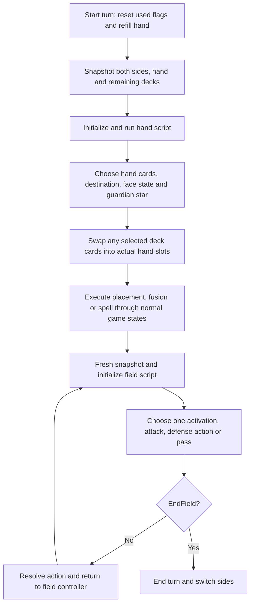

# AI hard mode: decision flow and mod targets

Research baseline: ReDecomp `011376e91`, SLUS_01411, 2026-09-24. This is a
research/design document describing the unmodified game. The implementation
is documented separately in [the AI Hard Mode package](../mods/ai-hard-mode/README.md).

The retail AI is a scripted priority system, with limited recursive fusion
search. It does not search a tree of future turns. Its advantages include
access to upcoming deck cards and, for six duelists, knowledge of face-down
cards. Its weaknesses include fixed card priorities, inconsistent stat
evaluation, hardcoded position rules, and always choosing the first guardian
star. Increasing its existing parameter values alone will not fix these.

Evidence labels used below:

- **Source:** directly established by the current C and its callers.
- **Bytecode:** established by decoding this workspace's disc data.
- **Proposal:** a suggested mod behavior, not existing game behavior.
- **Open:** still needs a focused runtime test or further analysis.

## Research sources and reproduction

The upstream [AI script investigation, PR #6006](https://github.com/krystalgamer/memories-decomp/pull/6006)
provided the starting script analysis and disassembler. The imported tool is
pinned to commit `2a9a0f2598564712a2945e9e695ee232cfcf5402`; its local changes
are provenance and the note reference. Several qualifications and corrections
to that investigation are documented below, especially actual deck swapping,
fusion-depth behavior, and the meaning of the placement flag.

Run from the repository root:

```sh
python3 tools/project/ai_script_disasm.py --out tmp/ai-hard-mode-research/listings
```

The [disassembler](../tools/project/ai_script_disasm.py) reads the user's
`game/DATA/WA_MRG.MRG`. It writes full hand/field listings, a listing for each
of the 39 duelists, an index, and verification results. Generated bytecode
listings stay in ignored `tmp/`.

This run reproduced 1,314 hand instructions and 795 field instructions, with
no unknown opcodes, overlapping instructions, invalid branch destinations,
or per-duelist register/return-stack analysis errors. Recursive decoding and
linear decoding agree. Both 6,144-byte chunks are identical across all seven
terrain packages. Their SHA-256 prefixes are `0cda7f9ce737e35c` (hand) and
`d8bf4e5b8d135721` (field). The scripts collectively use 47 of 67 opcodes.

An additional constant-propagation check confirmed that all six guardian-star
writes resolve to zero for each of the 39 opponents, and that script opponent
fields 4 and 5 (table bytes 5 and 6) are unused. The opponent strategy table
below was calculated from the decoded random-branch chains.

These are static checks, not a new playtest. Existing PC timing traces cover
Simon and Teana, not every duelist or tactical situation; see
[the recorded timing investigation](pc-build.md#ai-thinking-time).

## 1. How an AI turn actually runs

**Source + bytecode.** One hand program and one field program serve every
duelist. The programs branch on opponent ID and read a nine-byte opponent
parameter row. Terrain does not select a different strategy program.



The VM has 20 registers and an eight-entry return stack. `AiScript_Init`
clears its registers, scratch state and selection record. `AiScript_Run`
returns 0 to continue next frame, 1 for `EndHand`, 2 for `PlayFieldCard`, or
3 for `EndField`. Timing yields resume the current cursor; they do not
restart a decision. A completed field action returns to the controller,
which rebuilds the snapshot and initializes the script for the next action.
Thus priorities and random choices can be reconsidered within the same turn.

The VM's `VSync(1) >= 240` check happens between handlers. It cannot interrupt
an expensive fusion search inside one handler. It is not a search-depth
setting or evidence that slower hardware makes worse choices.

Newly placed monsters can attack that turn. Attacks mark the real card used;
the AI's defense/pass actions also consume it for the remainder of its turn.
The next draw phase clears used flags. `MoveCard` only marks the temporary
AI snapshot, commonly to skip a target during the current decision. It is
not the deck-swap operation.

Sources: [hand controller](../src/game/duel_scene_hand_actions.c),
[field controller](../src/game/duel_scene_field_actions.c),
[VM](../src/game/ai_script_vm.c), [turn eligibility](duel-turn-action-eligibility.md).

## 2. Card swapping is real, and its limits are known

**Source.** The active-card snapshot contains five own monster slots, five
own spell/trap slots, then the compacted hand followed by the remaining deck
in draw order. The opponent's corresponding records are 55 slots later.
The AI's searchable hand window is opponent parameter byte 0, not necessarily
the physical five-card hand.

With a full hand, a window of 20 means five held cards plus the next 15 deck
cards. Early villagers use 5; Seto uses 10; Pegasus uses 16; late bosses use
20. This is access to the existing shuffled deck, not generation of any
desired card from the opponent's weighted card pool.

The previously unresolved execution step is in
[`func_8001BAF0`](../src/game/func_8001B938.c):

1. Copy the five current hand indices to temporary availability markers.
2. Reserve any actual hand cards already selected for the play.
3. For each selected snapshot slot at or above 16, find the first remaining
   unreserved hand slot.
4. Exchange its deck record with the selected upcoming card's record,
   preserving the positional deck indices.
5. Rebuild that hand card's display and rewrite the selection to slot 11–15.

The displaced hand card goes back into the deck position occupied by the
chosen card. Multiple selected upcoming cards can be materialized, subject
to the five physical hand slots. The routine does not rank which unselected
held card would be best to surrender: it takes the first available slot.

This runs immediately after the hand script finishes and before the hand
cursor consumes the selection. Consequently, a selected slot above 15 does
not simply send the cursor out of bounds, as the upstream note had left open.
The actual swap is established by source; no late-game swap animation was
newly traced during this investigation.

Sources: [snapshot exporter](../src/game/func_80027DF8.c),
[hand range](../src/game/ai_script_control_flow.c),
[window lookup](../src/game/ai_get_hand_size.c),
[opponent parameters](../src/game/ai_opponent_data.c).

## 3. Hand decision priorities

**Bytecode.** Offsets below are relative to the hand program at `0x801A8000`.

| Priority | Behavior |
|---|---|
| Prelude | Read opponent ID, face-down visibility policy, both LP values and the spell-use percentage. |
| Lethal burn, `005E` | If the player's back row is empty, try Sparks, Hinotama, Final Flame, Ookazi, then Tremendous Fire; immediately play the first available lethal one. |
| Home terrain, `0130` | Ocean/Forest/Mountain/Desert/Meadow Mage and Guardian Neku restore Umi/Forest/Mountain/Wasteland/Sogen/Yami when available and terrain differs. The High Mages lack this special priority. |
| Board comparison, `024C` | Compare the best monster on each side by the higher of ATK/DEF. Both empty follows the ahead path. Missing own monster or failing to be strictly stronger follows the behind path. |
| Ahead: Duster, `0299` | If the player has a back row, try Harpie's Feather Duster with the opponent's configured percentage. |
| Ahead: choose strategy, `02DE` | Below the opponent's LP threshold, choose B. Otherwise use opponent-specific A/B/C rolls, with a separate distribution when the AI's weakest monster is weaker than the player's best. |
| Behind, `10E0` | Play a hand-window monster that meets the player's best power; otherwise try fusion while at least 33 deck cards remain; otherwise look for the removal/stalling cards below. |

The LP threshold is checked on the ahead path after earlier priorities; it
is not a universal mode switch that overrides every hand decision.

| Strategy | What it tries |
|---|---|
| A: `0BA5` | Best single monster or fusion chain from field/hand-window candidates. Can fuse onto an existing monster. If an existing field monster alone wins, try a terrain for its type, otherwise another hand play. |
| B: `0FDB` | Improve the weakest own field monster with a fusion search. Exclude unsuccessful card IDs and try the next weakest; fall back to A if no candidate remains. |
| C: `1042` | First trap, else equip, else magic, else ritual in the window; otherwise strongest monster. This is type/slot priority rather than utility scoring. |

The behind-path answer order is type-specific removal, Spellbinding Circle,
Shadow Spell, Crush Card if target base ATK is at least 1500, Raigeki, a
listed trap, Swords unless the player is already pinned, then Dark Hole if
the AI has fewer monsters. Otherwise return to A. The trap order is
Widespread Ruin, Acid Trap Hole, Invisible Wire, Bear Trap, Eatgaboon, House
of Adhesive Tape, Fake Trap. The early-deck condition counts cards; it is
not an explicit turn-number check.

Monsters generally go to the first empty zone or overwrite the weakest
monster. Back-row cards use an empty zone; a trap can overwrite a random
back-row slot, and an equip can be used on a monster when the row is full.

The selection byte named `random` is misleading. In the hand controller,
setting byte 8 explicitly drives the face-down animation and sets flag
`0x1000`; clearing it permits immediate use/face-up handling. Similarly,
`PlayFaceUp` writes a material list, and `SetPosition` writes a destination
slot, not an attack/defense position. The old function names are not a
reliable behavior specification.

The lethal-burn priority is not a ban on other burn plays: strategy C can
select a burn card as generic magic and put it on the back row, where the
field policy decides when to activate it.

## 4. Field actions, attacks and defensive behavior

**Bytecode + source.** Offsets are relative to `0x801A9800`. Each decision
walks these priorities again after the previous action has resolved.

First, evaluate available back-row cards. These are card-specific rules:

| Card family | Activation policy |
|---|---|
| Harpie's Feather Duster | Player has a back row, then configured chance. |
| Burn and healing | Hold if own LP is at least player's LP. Otherwise use if own LP exceeds the threshold, or if player's back row is empty. In the remaining case, hold with byte-7 probability and use otherwise. |
| Equip | First compatible monster, not the highest-value target. |
| Ritual | `Duel_CheckRitual` must succeed. |
| Dark-piercing Light | All player monsters are face-down and player has more monsters. |
| Swords | Player not already pinned, and AI lacks a monster or player's best is stronger. |
| Stop Defense | AI not pinned, plus either the lethal comparison or sufficient monster count and the strongest-pairs ATK test. |
| Type removal / debuffs | Player's best at least matches own best; type removals must match the target type. Crush Card additionally tests 1500 ATK. |
| Raigeki / Dark Hole | Threat condition plus player count at least AI count / strictly greater than AI count. |
| Field spells | Threat condition, different strongest-monster types, changed terrain, and favorable type relationship; this is a fixed type rule, not total-board evaluation. |

The burn/heal policy can withhold a useful or winning activation based on LP
comparison. Raising byte 7 improves Duster willingness but can increase
holding in the last burn/heal case: it is not a universal intelligence knob.

Next, at `08F4`, a fixed list of twenty wall monsters is sent to defense
**before attacks are considered**:

Cocoon of Evolution, Millennium Shield, Labyrinth Wall, Mystical Elf,
Dragon Piper, Castle of Dark Illusions, Metal Guardian, Sleeping Lion,
Hard Armor, Spirit of the Harp, Prevent Rat, Green Phantom King, Gorgon Egg,
Wall Shadow, Blocker, Golgoil, 30,000-Year White Turtle, Queen Bird,
Yado Karu, Boulder Tortoise.

Attack selection begins at `0AD0`, unless Swords pins the AI:

1. Check a single lethal attack using strongest own unused ATK against
   weakest enemy attack-position ATK; with an empty enemy field, check direct
   lethal damage.
2. Examine enemy attack-position monsters strongest first. Use the weakest
   own unused attacker that strictly wins, including guardian matchup.
3. Repeat against defense-position monsters, using target DEF.
4. Try face-down targets with the configured blind-attack percentage, using
   the strongest own attacker.
5. If the enemy field is empty, attack directly with the strongest remaining
   attacker.

`FindKiller` uses current snapshot stats and the +/-500 guardian matchup.
It requires a positive difference, so an equal-power trade is not a normal
winning-target choice. This is a greedy sequence of attacks, not an optimal
assignment of all attackers and not a multi-turn search.

At `0C7F`, remaining unused monsters go to defense, except eight hardcoded
cards that are passed without changing position: Blue-Eyes Ultimate Dragon,
Gate Guardian, Perfectly Ultimate Great Moth, Meteor B. Dragon, B. Skull
Dragon, Black Luster Soldier, Blue-Eyes White Dragon, Metalzoa. This exception
preserves their current position; it does not explicitly force attack mode.

There is therefore no single persistent defensive-mode bit demonstrated
here. The apparent mode combines the behind-hand branch, low-LP strategy B,
wall-card rule, Swords handling, and leftover-defense rule. VM state is
cleared at each new decision.

## 5. Information advantages and evaluation weaknesses

**Face-down sight — bytecode.** Heishin (8), Pegasus (15), Heishin 2nd (35),
Seto 3rd (36), DarkNite (37), and Nitemare (38) pass visibility 0, allowing
the normal target searches to use hidden cards' identities/stats. Others
use visibility 1 in those searches. All snapshots contain the data; the
search operands enforce the policy. A replacement mod must enforce its own
information policy rather than blindly consuming everything exported.

**Guardian choice — bytecode.** All six hand-script writes choose star 0
(the card's first star); initialization also defaults it to zero. The
second star is available in hand/deck snapshots but is not selected by the
retail policy. Combat still accounts for the currently selected star.

**Mixed stat models — source.** Strongest/weakest field selection uses
`Duel_CalcCardStats` snapshot values, including modifications. Several
subsequent comparisons reload card IDs and call `CalcCardPower`, which uses
card-table stats plus terrain, but omits the field record's accumulated
stat modifier. Despite its name, `Duel_GetBaseCardStat` includes terrain;
the original upstream interpretation of it as unmodified base stats was
incomplete. This affects ahead/behind classification and the lethal check.
It can disagree with `FindKiller`, which uses boosted stats and guardian
matchups. Fixing only the selection of strongest cards does not fix those
later comparisons.

**Fusion search — source.** `Ai_CompleteFusion` recursively tests actual
fusion/equip compatibility and ranks results by base ATK or DEF, preferring
shorter paths for ties. Existing field candidates begin with current stats,
but resulting cards use card-table stats plus terrain. There is no simulation of the full
post-play field, future enemy turn, material value, or cumulative equip
bonus in that score.

Important details hidden by a simple "depth + 1" description:

- `FindBestCombo` sets its limit to operand + 1. A field seed recurses when
  that limit is at least 2, but a hand seed only recurses at **3 or above**.
  Operand 1 therefore considers single hand cards and field-plus-hand
  combinations, but does not start a two-card fusion purely from the hand.
  Simon, Teana, Villager 3, Mage Soldier and Seto 2nd have this normal A
  setting. The low-deck clamp to 1 also introduces it for other opponents.
- Field-seed recursion marks `fusion_used[i]`, the same-index hand candidate,
  although the seed is a field card. That candidate is excluded for that
  branch. This needs a tactical fixture before deciding how to correct it.
- `EvaluateFusion` begins recursion at depth 0; a one-addition improvement
  can be stored at best depth 0, but its final success result tests whether
  best depth is nonzero. Consequently not every found improvement is
  reported as successful. Do not describe B as a reliable general equip or
  upgrade optimizer without testing this behavior.
- Scratch/material buffers have six bytes, while the executor supports
  five hand cards. Increasing depths blindly can overrun path/terminator
  storage or exceed what can be executed, and increases uninterruptible
  search time. Use an explicit bounded planner for deeper searches.

Sources: [fusion search](../src/game/ai_fusion.c),
[base-power evaluation](../src/game/ai_script_calc_card_power.c),
[winning attacker](../src/game/ai_script_find_killer.c),
[equip/fusion checks](../src/game/duel_card_checks.c).

## 6. Parameters and opponent personalities

**Source + bytecode.** Rows live at `gDuel_aOpponentData`, address
`0x800917F0`. Row zero exists, but playable opponent IDs are 1–39.

| Byte | Meaning in the retail policy |
|---|---|
| 0 | Searchable hand/deck window, 5–20. |
| 1 | LP threshold multiplied by 100, normally 1000/2000/3000. |
| 2 | Remaining-deck threshold for reducing fusion search, normally 5/10/20. |
| 3 | Strategy A depth operand, 1–3; see the hand-seed restriction above. |
| 4 | Strategy B setting, 1–3; script passes this minus one to `EvaluateFusion`. |
| 5, 6 | Neither retail script reads these. Values of 4 or 5 on late bosses are not evidence of deeper fusion search. |
| 7 | Duster-use and conditional burn/heal-hold percentage, 25/50/75. |
| 8 | Blind-attack percentage, 0/25/50/75. |

The A/B/C distributions are constants in bytecode, not bytes in this table.
A 40% roll followed by a 50% roll yields 40/30/30, not 40/50/10.
Below, distributions are nominal percentages from the `rand()%100` tests;
the RNG/modulo implementation can introduce small statistical bias.

The two distributions apply only when the hand flow reaches its strategy
roll. "Strong board" means its weakest monster meets the opposing best (or
none exists); "weak member" means it does not. These are choices of initial
strategy; fallbacks can change the final action. Depth A/B columns report
raw table settings, not guaranteed material counts. Duster and blind columns
are percentages.

| ID | Opponent | Window | Sees hidden | LP threshold | Depth A/B | Duster | Blind | Strong board A/B/C | Weak member A/B/C |
|---:|---|---:|:---:|---:|---|---:|---:|---|---|
| 1 | Simon Muran | 5 | no | 2000 | 1/1 | 25 | 50 | 40/30/30 | 30/30/40 |
| 2 | Teana | 5 | no | 3000 | 1/2 | 25 | 25 | 30/60/10 | 20/60/20 |
| 3 | Jono | 5 | no | 1000 | 2/1 | 25 | 75 | 70/15/15 | 70/15/15 |
| 4 | Villager 1 | 5 | no | 2000 | 2/2 | 25 | 50 | 15/15/70 | 20/20/60 |
| 5 | Villager 2 | 5 | no | 3000 | 3/1 | 25 | 75 | 70/15/15 | 30/10/60 |
| 6 | Villager 3 | 5 | no | 1000 | 1/3 | 25 | 25 | 30/60/10 | 40/30/30 |
| 7 | Seto | 10 | no | 2000 | 3/3 | 50 | 50 | 70/15/15 | 30/40/30 |
| 8 | Heishin | 20 | yes | 2000 | 2/2 | 75 | 50 | 30/40/30 | 20/60/20 |
| 9 | Rex Raptor | 8 | no | 1000 | 3/2 | 25 | 75 | 70/15/15 | 70/15/15 |
| 10 | Weevil Underwood | 8 | no | 1000 | 2/3 | 25 | 50 | 30/60/10 | 30/30/40 |
| 11 | Mai Valentine | 10 | no | 2000 | 3/3 | 75 | 25 | 15/15/70 | 20/60/20 |
| 12 | Bandit Keith | 12 | no | 2000 | 2/2 | 50 | 50 | 70/15/15 | 40/30/30 |
| 13 | Shadi | 12 | no | 3000 | 2/2 | 50 | 25 | 30/30/40 | 20/60/20 |
| 14 | Yami Bakura | 14 | no | 2000 | 3/3 | 75 | 25 | 15/15/70 | 30/40/30 |
| 15 | Pegasus | 16 | yes | 2000 | 3/3 | 75 | 0 | 30/30/40 | 20/20/60 |
| 16 | Isis | 16 | no | 2000 | 3/3 | 75 | 25 | 30/40/30 | 10/60/30 |
| 17 | Kaiba | 16 | no | 2000 | 3/3 | 75 | 50 | 70/15/15 | 30/60/10 |
| 18 | Mage Soldier | 12 | no | 1000 | 1/1 | 25 | 75 | 40/30/30 | 30/30/40 |
| 19 | Jono 2nd | 10 | no | 1000 | 1/2 | 25 | 75 | 30/60/10 | 20/60/20 |
| 20 | Teana 2nd | 10 | no | 3000 | 2/1 | 25 | 25 | 70/15/15 | 70/15/15 |
| 21 | Ocean Mage | 14 | no | 1000 | 2/2 | 50 | 50 | 30/40/30 | 40/30/30 |
| 22 | High Mage Secmeton | 16 | no | 2000 | 2/3 | 50 | 25 | 30/60/10 | 20/60/20 |
| 23 | Forest Mage | 14 | no | 1000 | 2/2 | 50 | 50 | 15/15/70 | 30/40/30 |
| 24 | High Mage Anubisius | 16 | no | 2000 | 3/3 | 50 | 25 | 30/30/40 | 20/60/20 |
| 25 | Mountain Mage | 14 | no | 1000 | 3/2 | 50 | 50 | 70/15/15 | 30/10/60 |
| 26 | High Mage Atenza | 16 | no | 2000 | 3/3 | 50 | 25 | 15/15/70 | 10/60/30 |
| 27 | Desert Mage | 14 | no | 1000 | 2/2 | 50 | 50 | 15/15/70 | 30/30/40 |
| 28 | High Mage Martis | 16 | no | 2000 | 2/3 | 50 | 25 | 30/60/10 | 20/60/20 |
| 29 | Meadow Mage | 14 | no | 1000 | 3/2 | 50 | 50 | 70/15/15 | 40/30/30 |
| 30 | High Mage Kepura | 16 | no | 2000 | 3/3 | 50 | 25 | 40/30/30 | 20/60/20 |
| 31 | Labyrinth Mage | 16 | no | 2000 | 3/3 | 75 | 75 | 70/15/15 | 30/10/60 |
| 32 | Seto 2nd | 18 | no | 1000 | 1/2 | 50 | 25 | 30/60/10 | 20/60/20 |
| 33 | Guardian Sebek | 20 | no | 1000 | 2/2 | 50 | 50 | 15/15/70 | 20/20/60 |
| 34 | Guardian Neku | 20 | no | 3000 | 2/1 | 50 | 75 | 70/15/15 | 70/15/15 |
| 35 | Heishin 2nd | 20 | yes | 2000 | 2/2 | 75 | 0 | 30/40/30 | 30/40/30 |
| 36 | Seto 3rd | 20 | yes | 2000 | 2/2 | 75 | 0 | 30/30/40 | 20/60/20 |
| 37 | DarkNite | 20 | yes | 2000 | 2/2 | 50 | 0 | 15/15/70 | 20/20/60 |
| 38 | Nitemare | 20 | yes | 1000 | 2/2 | 75 | 0 | 70/15/15 | 30/60/10 |
| 39 | Duel Master K | 15 | no | 2000 | 3/3 | 50 | 25 | 30/40/30 | 20/60/20 |

## 7. Implementing a hard-mode mod in this port

**Source.** The managed `MEMORIES_EVENT_AI` event wraps `func_800279BC` in
`ai_turn_action.c`. Searching the current source finds its wrapper and
definition, but no normal gameplay caller. The actual hand/field controllers
call `AiScript_Init` and `AiScript_Run` directly. Subscribing only to that
event is not a demonstrated way to change normal opponents.

API 4 already provides function hooks; a core engine change is not required
just to reach the real AI. See [function hooks](modding.md#replacing-or-wrapping-a-game-function-api-4)
and [the host API](../src/pc/mods/modapi.h).

| Approach | What it buys | Limits |
|---|---|---|
| Tune opponent data | Adjust deck reach, thresholds, existing search settings and willingness. | Cannot change bytecode strategy splits, wall lists, sight exceptions, or stat errors. Restore owned data changes when disabled. |
| Replace/patch the scripts | Reorder card priorities, strategy rolls, exceptions, and guardian-star writes. | Preserve branch destinations and valid operands; account for all terrain copies/reloads. Still uses the native search algorithms. |
| Hook native searches | Correct particular scoring/search defects while retaining retail scripts. | Must preserve bytecode operand consumption and result contracts. Existing scripts can still make poor strategy choices. |
| Hook `AiScript_Init`/`AiScript_Run` | Own both hand and field decisions, filling the existing selection record and returning the established result codes. | Must retain normal execution, lifecycle, legal selection limits, and a bounded computation budget. Most control for a real hard mode. |

For a replacement planner, let initialization establish the phase and clean
state, then emit decisions through the existing hand/field contract. Reuse
the real placement, swap, fusion, effect and battle controllers. Do not mutate
the board to pretend actions already resolved. Field planning should refresh
after each action just as the current controller does.

`AiScript_Run` classifies terminal opcodes by handler identity, not the
handler's return value. If changing the dispatch table itself, preserve that
contract; API 4 function hooks or replacing `Run` avoid relying on a renamed
terminal handler being recognized.

Do not activate the unused `FindBestAttack` as a shortcut. It is absent from
both programs, and its current source has a non-advancing outer loop. The
three `LoadBest*` helpers also reference separate globals from the scratch
members written by that function. This is unfinished/dead machinery, not a
ready-made stronger opponent.

## 8. Proposed hard-mode behavior

**Proposal.** Build improved decisions first, with information advantages
separately configurable. That lets us measure whether the AI is smarter
without conflating the result with better draws or deck access.

1. Use one effective-stat evaluator for threats, lethal damage, defense,
   terrain, equip changes and guardian matchup. Evaluate both guardian
   stars for a new monster.
2. Check winning attack sequences before fixed wall/defense preferences.
   Score short sequences across all five attackers, including profitable
   trades, total damage and material preservation, with a strict node budget.
3. Rank hand plays by their resulting board and usable actions. Keep fusion
   search bounded by executable material counts; value cards spent, removal,
   survival, and the remaining hand instead of only maximum base ATK/DEF.
4. Replace fixed defense lists with predicted damage and survival decisions.
   Preserve opponent flavor with preferences among similarly strong moves.
5. Improve spell timing and targets: lethal burn first, meaningful healing,
   worthwhile removal, best equip recipient, full-board terrain value, and
   back-row management.
6. Make deck-window size and face-down sight explicit options. A strict
   five-card/no-hidden-stats profile, retail privileges, and boss privileges
   are separable from tactical strength. This is a design proposal, not a
   user-selected default.

Opponent deck pools are another independent difficulty control. The port
already supports them through [gameplay tables](gameplay-tables.md); changing
those is deck balance rather than a fix to decision quality.

## 9. Validation needed before shipping gameplay changes

Focused fixtures should cover winning plays before defense, guardian choice
flipping a matchup, terrain/equip changing a lethal calculation, equal-stat
trades, held versus swapped fusion materials, avoiding valuable-card swaps,
removal/healing timing, full field/back row, Swords, and almost-empty decks.
Also test each information policy so hidden state cannot leak into scoring.

The exporter writes a zero terminator but does not clear the whole remaining
snapshot, while searches use a fixed opponent window. Almost-empty decks
deserve a direct fixture rather than assuming the terminator clamps every
search. This is an open edge case, not a newly demonstrated gameplay bug.

Use fixed-seed comparison duels with identical decks, at least early,
middle and late opponents, and multiple terrains. Record selected actions,
projected versus actual damage, illegal/no-progress decisions, search nodes,
decision latency and win rate. Verify on Linux and Windows, with save/load
and mod disable/re-enable. Existing timing traces measure VM scheduling;
they do not establish hard-mode quality.

Keep pure planning separate from animation. Calling fusion/equip wrappers
during search can dispatch other mods' events, so compatibility and repeated
hypothetical queries need explicit treatment. Respect new card identities
and actual modded rules; hardcoded retail card-ID lists alone will not cover
all card packs.
